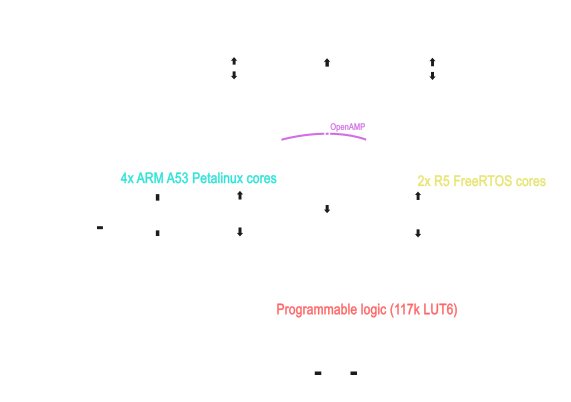

Here's a refined version of your README — more concise, clearer structure, and corrected phrasing for better readability:

---

# AMD\_OHW

**Efficient Pose Estimation and MPC for Quadrotors using Custom Hardware Acceleration on Zynq Ultrascale+ MPSoC (KV260)**
### 0.doc
This folder contains all relevant documentation for the hardware that we use.
## System Overview

This project targets efficient pose estimation and Model Predictive Control (MPC) on a quadrotor using the KV260 platform.

We utilize the integrated hard cores to run high-level algorithms on a PetaLinux/Yocto distribution, enabling seamless integration of hardware drivers and libraries (e.g., OpenCV).

Since Linux cannot meet hard real-time (RT) constraints, the R5 cores will run FreeRTOS to handle critical RT tasks such as MPC and Kalman filter-based pose estimation. The architecture will evolve as more sensors are integrated for improved pose estimation.

### Pose Estimation Tasks

* **Quadrotor Localization**: Sensor fusion using IMUs and ISP with known markers, leveraging Kalman filtering.
* **Obstacle Pose Estimation**: Machine Learning-based pose estimation of known obstacles to provide richer constraints for MPC.

### Hardware Acceleration Focus

* Programmable Logic (PL) will be used for:

  * Custom communication PHYs
  * MPC acceleration
  * Neural Network inference for obstacle detection
* Key hardware challenges include:

  * **Inter-core Communication**: Establishing OpenAMP links between Linux (A53) and RT (R5) cores.
  * **Shared Memory Access**: Efficient DDR4 sharing between CPUs and PL accelerators, potentially requiring DMA.

### Planned Peripherals

* **Camera**: 2 or 4-lane MIPI CSI input for pose estimation.
* **Flight Controller**: UART-based communication with the flight controller.

---

## Development Roadmap

Tasks may be completed in parallel rather than sequentially.

* [ ] MPC design and simulation on PC
* [ ] Quadrotor localization (OpenCV + IMU) on PC
* [ ] FreeRTOS bring-up on R5 cores
* [ ] PetaLinux/Yocto bring-up on ARM cores
* [ ] OpenAMP communication setup between A53 and R5 cores
* [ ] Porting MPC to FreeRTOS
* [ ] Porting localization algorithms to Linux cores
* [ ] Performance evaluation and hardware acceleration planning
* [ ] Hardware accelerator design and integration

---
## More documentation and planning documents
https://drive.google.com/drive/folders/1HF_yj-sk7PynRSuL3INojRO_0vQfTQ9e?dmr=1&ec=wgc-drive-hero-goto